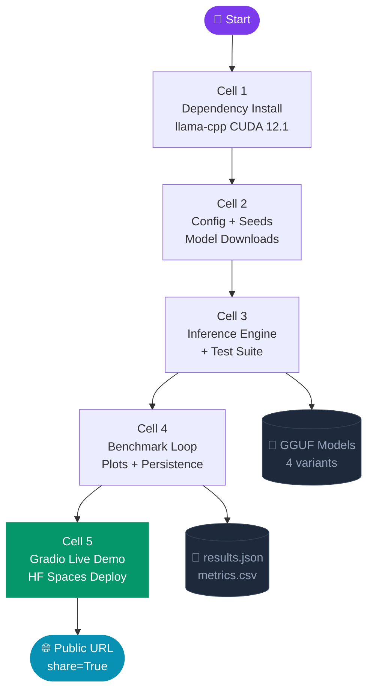

<!-- README.md — paste this entire file into your GitHub repo root -->

<div align="center">


<br/>


<br/>

### 🧠 Compare quantized LLMs live — memory, reasoning, and response quality at your fingertips

[**🚀 Try the Live Demo**](#) · [**📓 Open in Kaggle**](#) · [**📊 View Results**](#results) · [**🛠 How It Works**](#architecture)

<br/>

</div>

---

## ✨ What Is This?

> **A fully interactive benchmarking suite** that pits two quantization strategies — `Q4_K_M` (standard 4-bit) vs `IQ4_XS` (importance-matrix optimized 4-bit) — against each other across **three cognitive tasks**, on two state-of-the-art open-source LLMs.

No API keys. No paid services. 100% open-source, running on free Kaggle/HuggingFace GPUs.

<br/>

---

## 🎯 Models & Variants

<div align="center">

| Model | Variant | Quantization | Size | Strategy |
|:------|:--------|:-------------|:-----|:---------|
| 🔵 **Phi-3-mini-4k** | `phi_q4km` | Q4_K_M | ~2.3 GB | Standard K-quant medium |
| 🟣 **Phi-3-mini-4k** | `phi_iq4xs` | IQ4_XS | ~2.0 GB | Importance-matrix optimized |
| 🔴 **Mistral-7B-v0.3** | `mistral_q4km` | Q4_K_M | ~5.2 GB | Standard K-quant medium |
| 🟠 **Mistral-7B-v0.3** | `mistral_iq4xs` | IQ4_XS | ~4.1 GB | Importance-matrix optimized |

</div>

<br/>

---

## 🧪 Three Benchmark Tests

<div align="center">

```
╔══════════════════════════════════════════════════════════════════╗
║                                                                  ║
║   🧠 BUFFER WINDOW      📝 SUMMARY MEMORY     🔗 CHAIN-OF-THOUGHT ║
║   ─────────────────     ──────────────────     ─────────────────  ║
║   Sliding window of     Compressed running     Step-by-step math  ║
║   last 3 turns.         summary of history.    & logic reasoning. ║
║   Tests short-term      Tests long-term         Tests analytical   ║
║   recall accuracy.      fact retention.         problem solving.   ║
║                                                                  ║
╚══════════════════════════════════════════════════════════════════╝
```

</div>

<br/>

---

## 🏗️ Architecture



<br/>

---

## 📐 Pipeline — 5 Cells, One Notebook

```
┌─────────────────────────────────────────────────────────────────────┐
│  CELL 1 — 🔧 ENVIRONMENT                                            │
│  ▸ Single clean llama-cpp-python install (CUDA 12.1 wheel)          │
│  ▸ Gradio, matplotlib, seaborn, tqdm                                │
│  ▸ GPU detection + import verification                              │
└──────────────────────────────┬──────────────────────────────────────┘
                               │
┌──────────────────────────────▼──────────────────────────────────────┐
│  CELL 2 — ⚙️ CONFIG + DOWNLOADS                                     │
│  ▸ Full seed coverage: random + numpy + PYTHONHASHSEED=42           │
│  ▸ Kaggle-compatible paths (auto env-var fallback)                  │
│  ▸ Resume-capable downloads with 64KB chunk streaming               │
│  ▸ All 4 GGUF models verified on disk before proceeding             │
└──────────────────────────────┬──────────────────────────────────────┘
                               │
┌──────────────────────────────▼──────────────────────────────────────┐
│  CELL 3 — 🧠 INFERENCE ENGINE                                       │
│  ▸ Model-specific chat templates (Phi-3 vs Mistral)                 │
│  ▸ True token counting via llm.tokenize() — not word split          │
│  ▸ Buffer window test  → sliding 3-turn memory                      │
│  ▸ Summary memory test → string-based, no double inference          │
│  ▸ Chain-of-thought    → regex answer extraction                    │
└──────────────────────────────┬──────────────────────────────────────┘
                               │
┌──────────────────────────────▼──────────────────────────────────────┐
│  CELL 4 — 🏁 BENCHMARK LOOP + PLOTS                                 │
│  ▸ Per-model try/except — one failure never kills the run           │
│  ▸ Incremental JSON checkpoint after every model                    │
│  ▸ Tidy DataFrame → metrics.csv export                              │
│  ▸ 4 comparison plots: latency, token dist, stacked time, scatter   │
└──────────────────────────────┬──────────────────────────────────────┘
                               │
┌──────────────────────────────▼──────────────────────────────────────┐
│  CELL 5 — 🎨 GRADIO LIVE DEMO                                       │
│  ▸ Stateful session — model loads once, reused across messages      │
│  ▸ 4 interactive test modes switchable mid-conversation             │
│  ▸ Real-time metrics panel: latency, tokens, tokens/sec             │
│  ▸ Pre-run benchmark results embedded in accordion                  │
│  ▸ share=True → instant public URL from Kaggle                      │
└─────────────────────────────────────────────────────────────────────┘
```

<br/>

---

## 📊 Metrics Captured <a name="results"></a>

Every inference records:

| Metric | Method | Notes |
|:-------|:-------|:------|
| `latency_seconds` | `time.time()` wall clock | Full round-trip including tokenization |
| `prompt_tokens` | `llm.tokenize(prompt)` | True subword count, not word split |
| `response_tokens` | `llm.tokenize(response)` | True subword count |
| `tokens_per_sec` | `response_tokens / latency` | Derived at display time |
| `extracted_answer` | Regex on CoT response | Numeric/fraction extraction |
| `buffer_depth` | `len(history) // 2` | Active turns in sliding window |
| `summary_length` | `len(summary_string)` | Chars of running summary |

<br/>

---

## 🔬 Bugs Fixed From Original Notebook

<div align="center">

| # | Original Bug | Fix Applied |
|:--|:-------------|:------------|
| 1 | `llama-cpp-python` installed **twice** | Single clean install in Cell 1 |
| 2 | `len(text.split())` for token count | `llm.tokenize()` — true subword tokens |
| 3 | Missing `PYTHONHASHSEED` seed | Set in Cell 2 alongside random + numpy |
| 4 | Hardcoded `/content/models/` (Colab only) | Env-var fallback, Kaggle-compatible |
| 5 | No error handling in model loader | Per-model try/except, skips on failure |
| 6 | No download resumption | Range requests + `.part` file kept |
| 7 | 2× inference per summary turn | String-based summary — no second LLM call |
| 8 | Wrong chat templates for both models | Phi-3 `<\|system\|>` · Mistral `[INST]` |
| 9 | All output to stdout only | JSON + CSV persisted after every model |
| 10 | No plots | 4 seaborn/matplotlib comparison charts |

</div>

<br/>

---

## 🚀 Quick Start

### Option A — Kaggle (recommended, free GPU)

```bash
# 1. Open a new Kaggle notebook
# 2. Enable GPU accelerator (T4 x2)
# 3. Paste cells 1–5 in order
# 4. Run all — Cell 5 prints a public share link
```

### Option B — HuggingFace Spaces

```python
# New Space → SDK: Gradio → paste all 5 cells into app.py
# Add requirements.txt:
llama-cpp-python
gradio>=6.0
numpy
pandas
matplotlib
seaborn
tqdm
```

### Option C — Local (GPU required)

```bash
git clone https://github.com/YOUR_USERNAME/llm-quantization-benchmark
cd llm-quantization-benchmark

# Install with CUDA 12.1 wheel
pip install llama-cpp-python --extra-index-url \
  https://abetlen.github.io/llama-cpp-python/whl/cu121
pip install gradio numpy pandas matplotlib seaborn tqdm

# Run
export PYTHONHASHSEED=42
export MODEL_DIR=./models
python main.py
```

<br/>

---

## 🖥️ Requirements

| Requirement | Value |
|:------------|:------|
| Python | 3.10+ |
| GPU | NVIDIA T4 / P100 (≥8GB VRAM) |
| CUDA | 12.1 |
| Disk | ~14 GB (all 4 models) |
| RAM | 16 GB+ |
| Network | HuggingFace access for model download |

<br/>

---

## 📁 Output Files

```
/kaggle/working/outputs/
├── results_TIMESTAMP.json       ← Full nested benchmark results
├── metrics_TIMESTAMP.csv        ← Tidy DataFrame (one row per inference)
└── benchmark_plots_TIMESTAMP.png ← 4-panel comparison chart
```

<br/>

---

## 🧩 Tech Stack

<div align="center">


</div>

<br/>

---

## 🌱 Reproducibility

- **Seed**: `GLOBAL_SEED = 42` applied to `random`, `numpy`, `PYTHONHASHSEED`, and llama-cpp generation
- **Determinism note**: `temperature=0.7, top_p=0.9` introduce controlled sampling; seed mitigates but doesn't eliminate variance across hardware
- **Checkpoints**: Results saved after every model — kernel crashes lose at most one model's data
- **Downloads**: `.part` files kept on interruption — re-run to resume without re-downloading

<br/>

---

<div align="center">


**Built for a college ML portfolio · 100% open-source · No API keys required**

⭐ Star this repo if it helped you understand LLM quantization!

</div>
